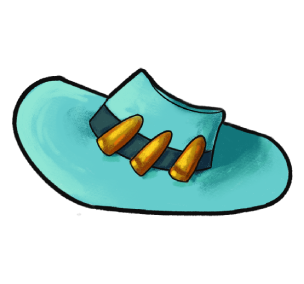

# Recoil Cowboy

Recoil Cowboy is a frantic & wacky 3D platformer where you play as a cowboy in a peaceful desert town. Until one day, a gang of thugs and their pets arrive in town, steal everyone's belongings, and build a speakeasy as their hideout.

This is a game being developed by students from <a href="https://www.imagecampus.edu.ar/">Image Campus</a>

   

## Credits

- **Lucio Stefano Piccioni** - *Programming*
- **Bernardo Kolton** - *Art*
- **Valentina Negroni** - *Art*
- **Santiago Ramos** - *Art*
- **Luca Falchini** - *Audio*
- **Ayrton Izquierdo** - *Audio*
- **Enrique Paredes** - *Audio*
- **Fabrizio Smetana** - *Audio*
- **Fabricio Zero** - *Audio*
- **Ivan Alzari** - *QA*
- **Camila María Gonella del Carril** - *QA*
- **Marco Augusto Lóndero** - *QA*
- **Franco Ripari** - *QA*
- **Emmanuel Nicolas Saavedra** - *QA*

**External Assets**

- "Rio Grande" *Font* - by: **Anton Krylov**

This game was also possible thanks to the support of:

**Professors:**

- Sergio Baretto
- Ignacio Mosconi
- Ramiro Cabrera
- Eugenio Taboada
- Nazareno Rivero
- Silvina Lemos

**Teaching assistants:**

- Guido Tello
- Elisa Gonda
- Julián Tinao
- Nicolas Arias Calvo
- Melissa Villarruel

**and all Image Campus Staff!**

## Links

Download it from itch.io: https://kapnack.itch.io/recoil-cowboy
